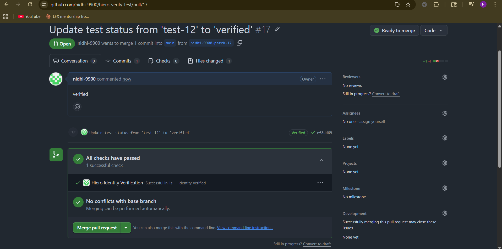
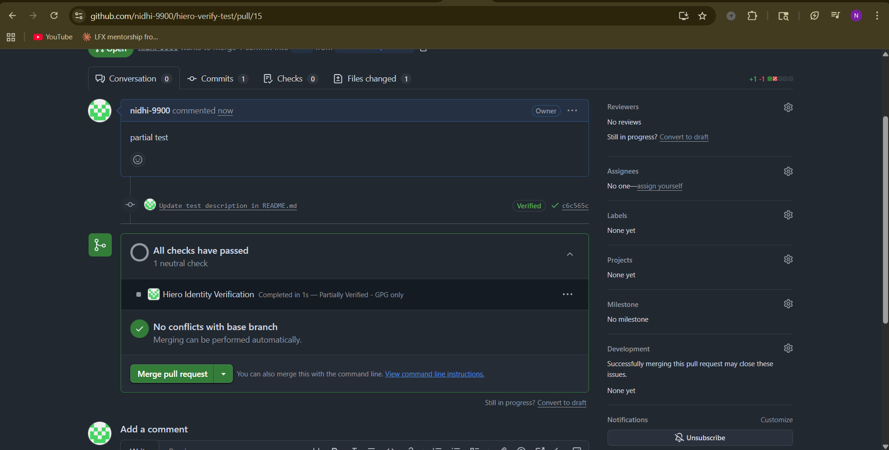
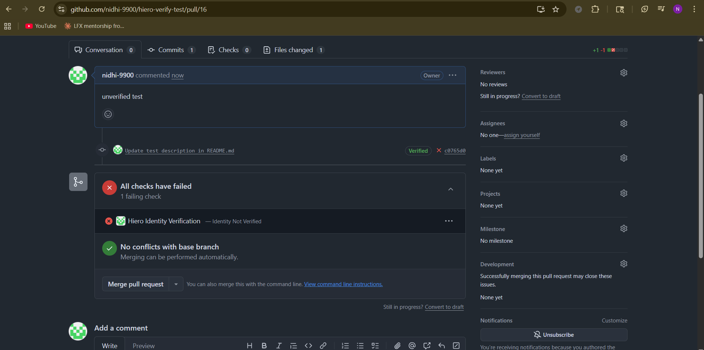
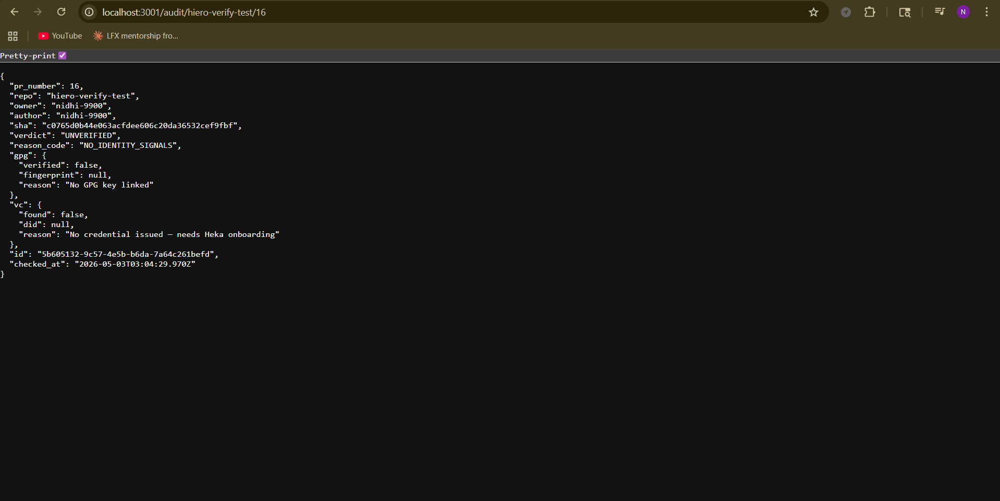

# Hiero Contributor Identity Verification - POC

This is a pre-application proof of concept for the LFX Mentorship project
"Hiero Contributor Identity Verification Prototype" (Issue #87).

The goal is to show that a GitHub App can verify contributor identity on
pull requests using two independent signals - a GPG key and a Verifiable
Credential - and report the result as a GitHub Check Run.

## The Problem

Git commit metadata can be set to anything. There is no built-in way to
prove that the person who opened a PR is actually who they say they are.
With AI agents now capable of impersonating developers, this is becoming
a real risk for open source projects.

This POC explores using decentralized identity (DIDs and Verifiable
Credentials) to add a cryptographic identity layer on top of GitHub's
existing workflow.

## What It Does

When a contributor opens a pull request:

1. GitHub sends a webhook to this server
2. The server verifies the webhook came from GitHub using HMAC signature
3. It looks up two things about the PR author:
   - whether they have a GPG key linked (GPG signal)
   - whether they have a Verifiable Credential issued by Heka (VC signal)
4. Both signals are combined into one trust verdict
5. A GitHub Check Run is posted to the PR with the result
6. The full verification decision is saved to an audit log

## Trust Verdicts

| Verdict | GPG | VC | Check Result |
|---|---|---|---|
| VERIFIED | yes | yes | green (success) |
| PARTIAL_GPG_ONLY | yes | no | yellow (neutral) |
| PARTIAL_VC_ONLY | no | yes | yellow (neutral) |
| UNVERIFIED | no | no | red (failure) |

A binary pass/fail is not honest. A contributor with a GPG key but no
Verifiable Credential is in a different trust state than someone with
neither. The four-level verdict reflects that.

## Project Structure
src/
index.ts               - starts the Express server
types.ts               - all shared TypeScript types
webhooks/
security.ts          - HMAC signature verification
handler.ts           - routes events through the pipeline
verification/
gpg.ts               - checks GPG signal from registry
vc.ts                - checks VC signal from registry
scorer.ts            - combines signals into verdict
github/
auth.ts              - GitHub App JWT and installation tokens
checkRun.ts          - creates and updates Check Runs on PRs
config/
repoConfig.ts        - reads per-repo hiero-identity.yml config
audit/
log.ts               - saves and reads audit records
routes/
audit.ts             - GET /audit/:repo/:pr_number endpoint
data/
registry.json          - mock contributor database (5 test users)
audit.json             - verification history
docs/
CREDENTIAL_SCHEMA.md   - SD-JWT VC schema design
WHAT_THIS_PROVES.md    - maps features to mentorship spec

The verification folder has no imports from Express or GitHub.
It is pure functions only - testable without running a server.

## Quick Start

```bash
git clone https://github.com/nidhi-9900/hiero-verify-poc.git
cd hiero-verify-poc
npm install
cp .env.example .env
```

Fill in `.env` with your GitHub App credentials:
APP_ID=your_app_id
PRIVATE_KEY_PATH=./your-app.private-key.pem
WEBHOOK_SECRET=your_webhook_secret
PORT=3001

Start the server:

```bash
npm run dev
```

Start smee in a second terminal to forward GitHub webhooks locally:

```bash
npx smee-client --url YOUR_SMEE_URL --path /webhooks/github --port 3001
```

## Audit Endpoint

Every verification result is stored and can be queried:
GET /audit/:repo/:pr_number

Example response:

```json
{
  "id": "uuid",
  "pr_number": 3,
  "repo": "hiero-verify-test",
  "author": "nidhi-9900",
  "verdict": "VERIFIED",
  "reason_code": "BOTH_GPG_AND_VC_PRESENT",
  "gpg": { "verified": true, "fingerprint": "ABC123" },
  "vc": { "found": true, "did": "did:key:z6Mk..." },
  "checked_at": "2026-05-03T08:00:00.000Z"
}
```

## Per-Repository Config

Add `.github/hiero-identity.yml` to any repository to control behavior:

```yaml
hiero-identity:
  required_trust_level: VERIFIED
  allow_gpg_only: false
  mode: block
```

If the file is missing the app falls back to safe defaults.
Set `mode: warn` to post the result without blocking the PR.

## What Is Mocked in This POC

The GPG and VC checks currently read from `data/registry.json` instead
of doing real verification. This is intentional and honest - the mock
functions return the same typed interface that real implementations will
use, so replacing them does not change anything else in the system.

The registry has five test contributors covering all four verdict states
so the full pipeline can be demonstrated without real credentials.

## What Gets Built in the Mentorship

- Phase 2: real GPG verification using openpgp.js against GitHub keys
- Phase 2: did:hedera anchoring using the Hashgraph DID SDK
- Phase 3: real Heka OID4VP credential presentation flow
- Phase 3: contributor onboarding with Heka cloud wallet
- Phase 4: VC revocation registry on Hedera

## Docs

- [Credential Schema Design](docs/CREDENTIAL_SCHEMA.md)
- [What This POC Proves](docs/WHAT_THIS_PROVES.md)
- [Mentorship Issue #87](https://github.com/LF-Decentralized-Trust-Mentorships/    mentorship-program/issues/87)
- [Heka Identity Platform](https://github.com/hiero-ledger/heka-identity-platform)

## Demo

All three verification states demonstrated on real GitHub pull requests.

**VERIFIED** - contributor has both GPG key and Verifiable Credential

    

**PARTIAL** - contributor has GPG key but no Verifiable Credential



**UNVERIFIED** - contributor has neither signal



**Audit Log** - full verification decision stored and queryable via API




